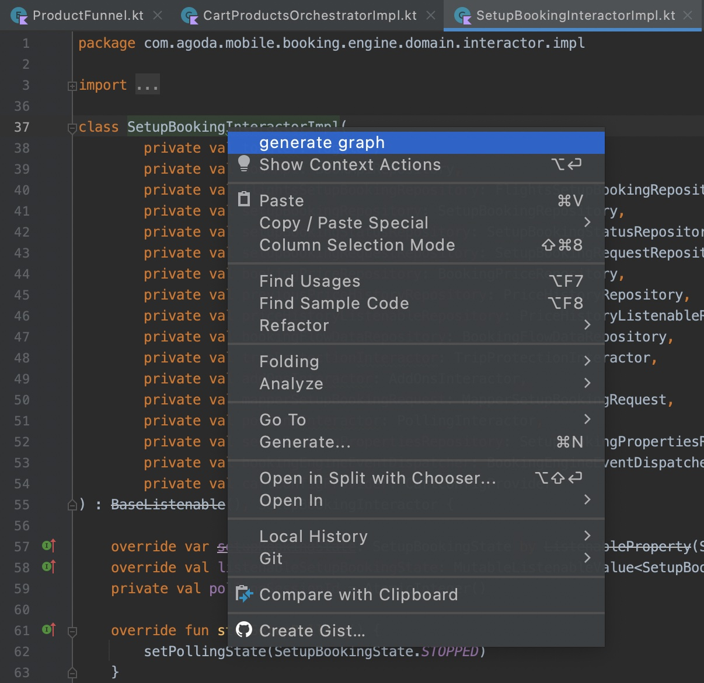
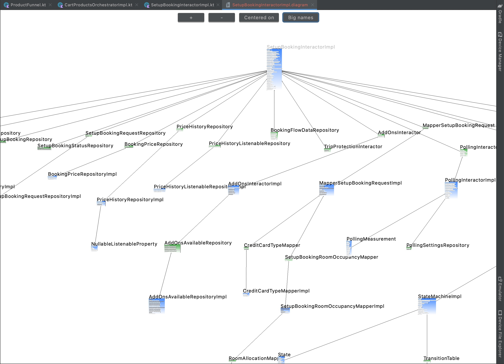

# Teldrassil

**How does it work**
1. Open class declaration source file
2. Right click on class name
3. Choose "generate graph"
   
4. Voila!
   

**Installation**
1. Run "./gradlew buildPlugin" command
2. Copy build/distributions/teldrassil-${version}.zip
3. In your Android studio / Intellij Idea: settings -> plugins -> press "gear icon" -> install plugin from disk... -> choose teldrassil.zip

## TODO
- [x] Create a new [IntelliJ Platform Plugin Template][template] project.
- [x] Generate a dependency graph from existing kt files structure
- [x] Generate a dependency graph from mixed java/kt files structure
- [ ] Unit tests
- [x] Support colored themes
- [x] Navigation to source code
- [x] Serialize graph into json/yaml
- [x] Implement an editor tab to visualize serialized graph
- [x] Add zoom editor behavior
- [x] Add drag & drop editor behavior
- [x] Update serialized data on graph modification
- [x] Advanced graph nodes positioning
- [ ] ???
- [ ] PROFIT