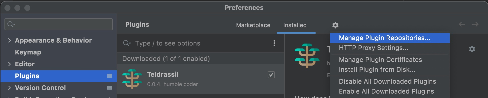
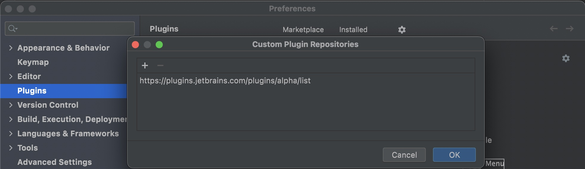
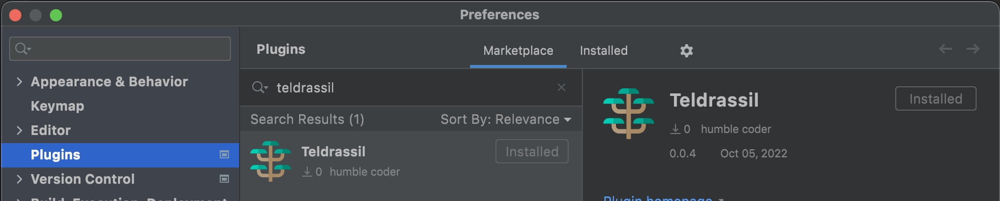

# Teldrassil

**Get it from Jetbrains marketplace**

Plugin is in Alpha channel, so it's not available by default.
1. Go to Preferences -> Gear icon -> Manager plugin repositories...
   
2. Add **Alpha** channel url - https://plugins.jetbrains.com/plugins/alpha/list
   
3. Browse marketplace for "Teldrassil" and install the plugin
   

****
**Or assemble locally with gradle command from project source**
1. Run "./gradlew buildPlugin" command
2. Copy build/distributions/teldrassil-${version}.zip
3. In your Android studio / Intellij Idea: Preferences -> Plugins -> Press "gear icon" -> Install plugin from disk... -> choose teldrassil.zip
****

<!-- Plugin description -->
**How does it work**
1. Open class declaration source file
2. Right click on class name
3. Choose "generate graph"
   
4. Voila!
   
5. Double-click on class nodes to navigate to source files
6. Drag & drop nodes to rearrange graph layout
7. Press +/- to zoom in/out
<!-- Plugin description end -->

## TODO
- [x] Generate a dependency graph from existing kt files structure
- [x] Generate a dependency graph from mixed java/kt files structure
- [x] Support colored themes
- [x] Navigation to source code
- [x] Serialize graph into json/yaml
- [x] Implement an editor tab to visualize serialized graph
- [x] Add zoom editor behavior
- [x] Add drag & drop editor behavior
- [x] Update serialized data on graph modification
- [x] Advanced graph nodes positioning
- [ ] ???
- [ ] PROFIT