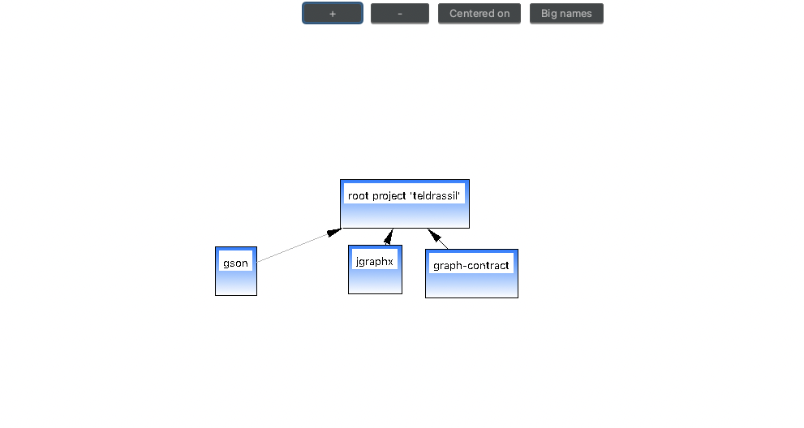

# Gradle dependency tree visualizer.

This is a companion gradle plugin for [Teldrassil](https://plugins.jetbrains.com/plugin/20022-teldrassil), the IntelliJ IDE plugin for visualizing dependency graphs in your projects. This plugin add the task `generateGradleDependencyGraph` to the list of tasks for your module.

## How to use

1. After installing the [IDE plugin](https://plugins.jetbrains.com/plugin/20022-teldrassil).  Add `gradlePluginPortal()` to to the list of repositories for your project if  you do not already have it.

       repositories {   
           gradlePluginPortal()  
       }

2. Add the plugin to you module/project

   Groovy:

       plugins {
           id 'com.agoda.gradledependencytreeplugin' version '0.0.1'
       }
   Kotlin DSL

       plugins {
           id("com.agoda.gradledependencytreeplugin") version "0.0.1"
       }

3. After syncing you should have the task `generateGradleDependencyGraph` among the task list for your module. The task has an optional argument for **configuration** you are generating the dependency graph for, if you do not pass in this argument it would attempt to generate the dependency graph for all the available configurations in the module, this could take some time for very big projects.

   Running task with configuration argument:

       gradle generateGradleDependencyGraph --configuration runtimeClassPath
   from the example above the dependency graph would be generated for the `runtimeClassPath` configuration.

   Running task without configuration argument:

       gradle generateGradleDependencyGraph

4. After the tasks completes, you should have a `diagrams` folder in the root folder of your module, this folder should contain a `.diagram` file which contains  json formatted text. If you have the **Teldrassil** IDE plugin installed, clicking on this `.diagram` file should render your dependency graph as shown below.

Also, here is a sample content of the diagram file.

    {
      "root_node_id": "teldrassil",
      "nodes": {
        "teldrassil": {
          "id": "teldrassil",
          "name": "root project 'teldrassil'",
          "class_type": "class",
          "fields": [
          ],
          "methods": [
    
          ],
          "x": 991,
          "y": 876,
          "fullClassName": ""
        },
        "com.google.code.gson:gson:2.7": {
          "id": "com.google.code.gson:gson:2.7",
          "name": "gson",
          "class_type": "class",
          "fields": [
    
          ],
          "methods": [
    
          ],
          "x": 837,
          "y": 959,
          "fullClassName": ""
        },
        "com.github.vlsi.mxgraph:jgraphx:4.2.2": {
          "id": "com.github.vlsi.mxgraph:jgraphx:4.2.2",
          "name": "jgraphx",
          "class_type": "class",
          "fields": [
    
          ],
          "methods": [
    
          ],
          "x": 1001,
          "y": 957,
          "fullClassName": ""
        },
        "com.agoda.maxstepanovski:graph-contract:0.0.1": {
          "id": "com.agoda.maxstepanovski:graph-contract:0.0.1",
          "name": "graph-contract",
          "class_type": "class",
          "fields": [
    
          ],
          "methods": [
    
          ],
          "x": 1096,
          "y": 962,
          "fullClassName": ""
        }
      },
      "edges": [
        {
          "id": "561aeff9-7dba-4af2-b370-21d03b0d334e",
          "from": "teldrassil",
          "to": "com.google.code.gson:gson:2.7"
        },
        {
          "id": "b369e269-c60e-4463-a5c9-f0395d2340d1",
          "from": "teldrassil",
          "to": "com.github.vlsi.mxgraph:jgraphx:4.2.2"
        },
        {
          "id": "c565c982-03a0-4f6a-ae13-a10ea0c2a0b3",
          "from": "teldrassil",
          "to": "com.agoda.maxstepanovski:graph-contract:0.0.1"
        }
      ]
    }

